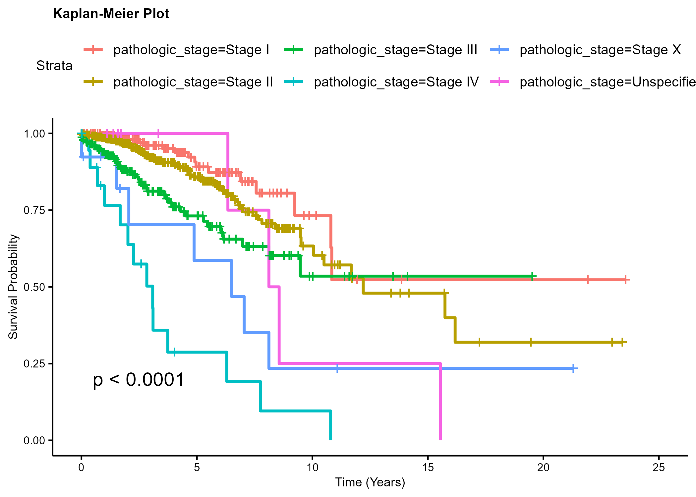
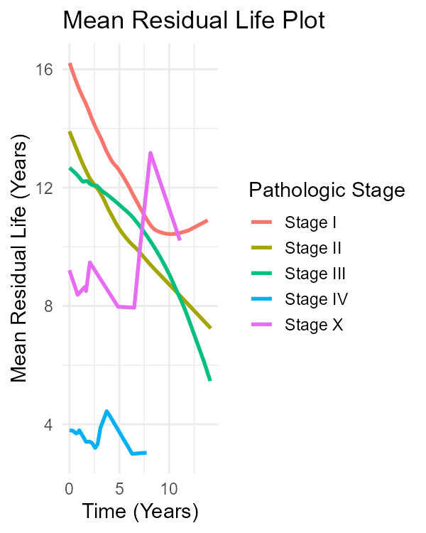
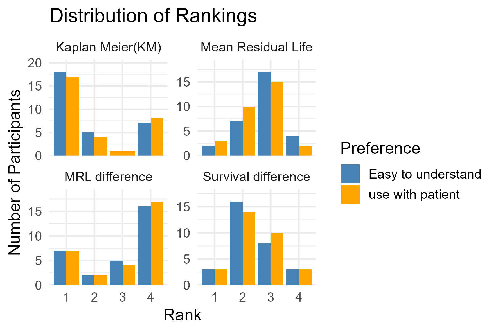

---

# Introduction

### Background information

Time-to-event or majorly known as survival analysis in which the analysis is carried out on data in the form of time origin until a particular event occurs or until there is a end point. The Survival data are asymmetric and censored which requires the use of specific approaches such as the survival function, Kaplan Meier Estimator and Survival Ratio plot. [@kaplan1958nonparametric ; @vandenberg2021hazard].

The survival function can be defined as the probability that a survival time is greater than or equal to time (t). This is the observed value of the random variable T that has the distribution function F(t).

The survival function is defined as $\mathbf{S}(t) = \mathbf{P}(\mathbf{T} \geq t)$. This represents the probability that a patient survives beyond a time t.This plays a crucial role in analyzing the time to death or the disease progression in these patients. [@bland2004log].


### Problem Statement

The primary interest of our study is to analyze these survival outcomes by using novel informative visualizations of the time to event data and in particular by comparing the survival curves that have different co-variates or treatments in a trial. [@kaplan1958nonparametric; @vandenberg2021hazard].

Very often, The Kaplan Meier plot and the Survival Ratio plot can be very challenging for clinicians to interpret as these plots are represented in terms of probability and cannot be explained in a straight forward manner to the patients. An alternative method for this is by introducing the clinicians to mean residual life in order to ensure that the interpretability can be significantly improved. [@chen2019mrl; @cai2010mrl].

The mean residual life provides the output in terms of units of time as opposed to probabilities.This makes it easier for the clinicians to convey the outcome as to how much longer the patient will survive. [@peterson2012graphs].

In order to evaluate the knowledge and the preferences of medical doctors and students on the time to event, an online survey is conducted. This helps us in ranking which plots the clinicians would find it more easy and understandable to convey to the patient.
 

### Understanding the Mean Residual Life

The Mean Residual Life function is denoted as the expected remaining time until an event of interest occurs. The event can be time-to-death, time-to-relapse given that the patient has survived up and till a time t. [@chen2019mrl; @cai2010mrl].

The Mean Residual Life function is denoted as $\mathbf{MRL}(t) = \mathbb{E}[\mathbf{T} - t \mid \mathbf{T} \geq t] = \frac{1}{\mathbf{S}(t)} \int_t^{\infty} \mathbf{S}(u)\,du$.

The terms are:  
(a) $\mathbf{T}$ — Time to event.  
(b) $\mathbf{f}(t)$ — The probability density function of event times.  
(c) $\mathbf{S}(t)$ — The survival function.
 [@vandenberg2021hazard].


### Interpretation in Medical Context

In clinical settings, The MRL provides a more accurate summary of survival compared to the traditional methods like Kaplan Meier or hazard function. This is mainly because MRL expresses the prognosis in units of time and hence our question "If a patient has survived t years, how much more are they expected to live on an average?" is answered.

In the context of breast cancer, the Mean Residual Life provides a time based view of the expected survival time in the future. Also this allows for direct comparisons between two groups taking into account remaining survival time at various time points.

The approach is completely transformed from "probability of survival" to "expected remaining time which enhances decision making and is useful in follow ups.

The another interesting thing is that these MRL plots can be combined with the the traditional methods that are the Kaplan Meier,Ratio plot to provide clinicians with a clearer picture of patient progression. [@therneau2020cox].


# Literature Review

### Survival Analysis in Health Research

Survival Analysis is one of the core methods used in research when the primary outcome is the time-to-event or death. Unlike other models,There are censored values within the data. Censored data is the case where the patient/patients do not experience the event during the time of the study.

The most used techniques which are the KM estimator estimate the effect of the co-variates on the survival time without assuming an underlying baseline hazard here by helping to quantify different survival times and as well as comparing the results between the various treatment groups. [@kaplan1958nonparametric].


### Hazard Function and It's Clinical Implications

The hazard function provides a rate at which the events occur up to a survival time t. In clinical sectors, this helps in gaining a foothold as to how recurrence risk changes over time. The two possible outcomes are it increasing due to the progression of the disease or it decreases due to effective treatment.

In this study pertaining to breast cancer, the hazard rates are not monotic: They are high after diagnosis or surgery and are low during remission and hence rising again later on. Identifying the patterns influence the follow up schedules and treatment intensities.[@vandenberg2021hazard].


### Mean Residual Life in Biomedical Studies

As mentioned earlier, mrl gives the expected remaining lifetime of a subject, given that the subject has survived up to a time period of T.

MRL is useful when the subject wishes to know the progression in terms of units of time as opposed to probabilities.This makes it easier for both the clinicians and the subjects to conversate the various survival outcomes.

Some of the real world data sets where MRL is heavily utilized is of Lung and Colorectal cancer,Cardiovascular risk assessment and HIV survival analysis.

On the other side, MRL remains under utilized in real world data sets [@chen2019mrl]. This project plugs in the gaps by applying the Mean Residual Life function to clinical data and gaining insights to clinical interpretations through a online based visualisation survey. [@chen2019mrl].


### Covariate Modelling in Breast Cancer Survival

The various factors that influence the Breast Cancer are clinical, demographic and molecular factors. Well known prognostic factors include:
(a) Tumor size and grade.
(b) Lymph node development.
(c) Presence of M1(Metasis).
(d) The stage of the diagnosis.

The patients that were diagnosed at the earliest stage that is stage 1, tended to have longer survival in contrast with those who were diagnosed at stage 3 and stage 4. 

The demographic variables are age, race and ethnicity. These impact the survival that are often mediated by access to care and treatment. The dataset used in this study are present with many of these co variates which help in a more accurate modelling of these survival outcomes. [@therneau2020cox].


### Use of R in Clinical Survival Modelling

R comes with various and wide range of packages that help in performing survival analysis as it is an open source software with a rich set of libraries within each package.

the key packages used in this study or that are widely used for survival analysis are:

(a)\textbf{Survival and survminer-For Kaplan Meier and Cox PH models}.

(b)\textbf{ggplot2 and plotly-For publishing the visualisations for interactive purposes}

(c)\textbf{mrlplot along with custom code for estimating and visualizing the Mean Residual Life functions}.

Despite survival analysis being well framed, there are very few and only few studies that integrate statistical modelling, MRL visualisation and clinician feedback into a single work and this project is one such example where combining all these help enhance the effect and relevance of survival analysis in real world healthcare scenarios. [@therneau2022survival].


# Dataset Overview

The data that is used in this study is TCGA-BRCA(Breast Invasive Carcinoma). This data set is available publicly from the National Cancer Institute's Genomic Data Commons. A detailed demographic, clinical and pathological data on patients that are diagnosed with breast cancer are provided.These also include clinical outcomes and survival modeling.

```{r include=FALSE}
surv_brca_cli <- read.csv("C:/Users/shyam/Downloads/surv_brca_cli.csv")
surv_brca_cli
```

```{r include=FALSE}
library(knitr)
library(dplyr)
library(kableExtra)
```

```{r echo=FALSE}
### key variables
variables <- data.frame(
  Variable = c("vital_status", "time", "time_in_years", "pathologic_stage", 
               "pathologic_t", "pathologic_n", "pathologic_m", "gender", 
               "race", "ethnicity"),
  Description = c("Patient outcome: whether the patient was alive or deceased",
                  "Time from diagnosis to event or censoring (in days)",
                  "Time to event or censoring converted to years",
                  "Overall pathological stage (e.g., Stage I, II, III, IV)",
                  "Tumor size category (T1–T4)",
                  "Lymph node involvement category (N0–N3)",
                  "Presence or absence of metastasis (M0/M1)",
                  "Patient gender",
                  "Self-reported race",
                  "Self-reported ethnicity")
)

kable(variables, caption = "Table: Key Variables in the Clinical Dataset")
```

### Summary of the cohort

(a) \textbf{Cohort Size:} The dataset includes 1,084 breast cancer patients.

(b) \textbf{Event Type:} The primary event that is taking place here is death, while censored data might being present, which tells us the patients who were alive at the time of the last follow-up.

(c) \textbf{Censoring Proportion:} The number of patients that were censored was approximately 0% (i.e., no patients were censored in this dataset).

(d) \textbf{Survival Time Range:} The survival time ranges from 0.0 to 23.56 years, with a median follow-up of 2.2 years.

### Preprocessing notes
(a) Patients with missing values in critical fields such as event status or time were excluded.  
(b) The time values were converted to a column named `time_in_years` to improve clinical interpretability.  
(c) Staging variables were grouped where appropriate to allow for stratified survival analysis.


```{r echo=FALSE}
kable(
  head(surv_brca_cli),
  caption = "First Six Rows of the Breast Cancer Dataset",
  col.names = c(
    "Gender",
    "Race",
    "Ethnicity",
    "Vital Status",
    "Pathologic Stage",
    "T Stage",
    "N Stage",
    "M Stage",
    "Time (Days)",
    "Time (Years)"
  )
)
```

# Methods

###  Data Preparation and Event Coding

The dataset was first checked and was then cleaned thoroughly so as to ensure that the factor levels were consistent. This consistency is needed especially for the categorical variables pathologic_stage, pathologic_t, pathologic_n and pathologic_m. The outcome variable, which is survival time, was measured in years and the event indicator was inferred from the vital_status variable. Patients who were coded as 1 were considered as Dead and those who were coded 0 were considered as Alive. There was a event indicator that had been obtained from the vital status variable with censoring being applied to those patients who were alive at the time of the last follow up.


### Survival Analysis techniques

### Kaplan-Meier Estimation

This estimator was used to non-parametrically estimate the survival function for the cohort and for each of the subgroups that were stratified by pathologic stage. Also we applied a log ranked test in order to check for significant differences between the groups.

In survival analysis the Kaplan-meier curves were selected was due to their familiarity and broad usage in clinical settings. [@kaplan1958nonparametric].

### Mean Residual Life Curves

The Mean Residual Life Curves represent the expected remaining survival time given that the subject has survived till time 't'. It is defined as:
$$
MRL(t) = \frac{1}{S(t)} \int_t^{\infty} S(u)\,du
$$

The curves were represented by pathologic stage to visualise the differences in the expected life time remaining. [@chen2019mrl].

### Difference Plots

There were mainly two types of difference plots that were used, one was based on the survival probabilities and the other one purely based on Mean Residual Life. In each of the scenarios, a reference group mainly stage 1 was selected and either the survival or the mrl function of the other groups was subtracted from it. These difference plots improved the interpretability of the survival trends across all the disease stages and helped in communicating the differences more easily to the clinicians. [@cai2010mrl].

### Survey for Clinical feedback

### Purpose

The purpose of conducting a survey was to figure out which of the Survival Plots were most preferred and were easy to interpret from a clinician's perspective to a patient. This helps in more advanced survival visualisations in the real-world setting.

### Survey Overview

The following were the components that were used in the survey:

(a)Target Population: This mainly focused on the Medical Students and Doctors.

(b)Data Collection: The data was collected anonymously from Google forms.

(c)Convenience Sampling: This was done voluntarily and without any randomization.

(d)Collection Period: The survey was conducted for 5 weeks ranging from 15th April 2025 to 20th May 2025.

### Survey Structure

The survey was organized into the following structure:

(a)The Demographic information such as Country and Qualification were collected and before that the participants were asked to rate their knowledge on a scale of 1 to 10 with 1 being that the participant has no knowledge and 10 being that the participant has expert knowledge.

(b)Participants were then presented with different types of visualisations of time-to-event data being Kaplan-Meier Plot, Survival difference plot, Mean Residual Life plot and Mean Residual Life Difference plot and were asked to provide their interpretation of these plots.This can be called as a Pre-assessment.

(c)After completing the Pre-assessment, the actual and correct interpretations were provided so as to encourage learning and gain a foothold as to what each of the plots were trying to convey. This can be termed as Learning Section.

(d)A new set of plots of the same type were provided but for different groups after learning about the interpretations of the pre assessment plots in the learning section.This was the Post-assessment.

(e)After completing the Post assessment section. The participants were asked to rank the plots based on the level of understanding by clinicians ranging from easy to hard and then they were asked which plot would the clinician prefer to use in order to convey it to the patient in the simplest manner possible.

[@peterson2012graphs].

```{r include=FALSE}
library(DiagrammeR)
library(rsvg)
library(DiagrammeRsvg)
```

```{r echo=FALSE}
# Create and export workflow
graph <- grViz("
digraph workflow {
  graph [layout = dot, rankdir = TB]
  node [shape = box, style=filled, fontsize=12, fontname=Helvetica]

  A [label = 'Data Cleaning', fillcolor = lightblue]
  B [label = 'Create Survival Object', fillcolor = lightblue]
  C1 [label = 'Kaplan–Meier Plot', fillcolor = lightblue]
  C2 [label = 'Mean Residual Life Plot', fillcolor = lightblue]
  D [label = 'Difference Plot', fillcolor = orange]
  E [label = 'Survey Feedback', fillcolor = salmon]

  A -> B
  B -> C1
  B -> C2
  C1 -> D
  C2 -> D
  D -> E
}
")
```

```{r echo=FALSE}
graph %>%
  export_svg() %>%
  charToRaw() %>%
  rsvg_png("workflow.png")
```

\begin{figure}[H]
  \centering
  \includegraphics[width=0.6\textwidth]{workflow.png}
  \caption{Workflow diagram illustrating the survival analysis process.}
  \label{fig:workflow}
\end{figure}

# Results

This presents the results across the different pathologic groups of Breast Cancer. These methods include both the traditional as well as alternative and time based visualisations that were used to provide a detailed view of the patient outcomes.The clinical survey feedback is then reported in order to determine the interpretability of each of the four plots.

### Kaplan Meier Survival Estimates

The Kaplan Meier analysis showed us that there is a significant difference in the survival probability across all the pathologic stages. The log rank p value is < 0.0001.The patients with Stage 1 of the disease exhibited the most ideal survival trajectory and hence they maintain the highest survival probability over time.On the other hand, stage 4 showed the lowest of all the outcomes such as a rapid decline in the starting years. The Stage 2 and Stage 3 patients generated a hierarchy with stage 3 constantly performing poorly over stage 2. The divergence among the curves got widened as time progressed. Hence we can say that the early stage patients(stage 1 and stage 2) showed a better long term survival compared to patients in stage 3 and stage 4. [@bland2004log].

```{r include=FALSE}
library(survival)
library(survminer)
library(dplyr)
library(tidyr)
library(ggplot2)
library(purrr)
```

```{r echo=FALSE, message=FALSE, warning=FALSE}
# Create the Surv object
surv_obj <- Surv(time = surv_brca_cli$time_in_years, event = surv_brca_cli$vital_status)

# Fit Kaplan-Meier model
km_fit <- survfit(surv_obj ~ pathologic_stage, data = surv_brca_cli)

# Save plot object
km_plot <- ggsurvplot(km_fit, data = surv_brca_cli, 
                      pval = TRUE,
                      title = "Kaplan-Meier Plot",
                      xlab = "Time (Years)",
                      ylab = "Survival Probability",
                      font.main = c(10, "bold"),
                      font.x = c(9),
                      font.y = c(9),
                      font.tickslab = 8)
```


```{r echo=FALSE}
ggsave("km_curve.png", plot = km_plot$plot, width = 7, height = 5, dpi = 300)
```


```{r,include=FALSE}

```

\begin{figure}[H]
  \centering
  \includegraphics[width=0.7\textwidth]{km_curve.png}
  \caption{Kaplan Meier plot for pathologic stages.}
  \label{fig:km_curve}
\end{figure}


### Mean Residual Life Curves

The Mean Residual Life Curves reveal that at time zero, stage 1 shows better initial mean residual life which shows a better life expectancy. On the other side, stage 4 shows the lowest initial mean residual life. This shows a lower life expectancy for the stage 4 patients. A stage dependent gradient is shown with earlier stages showing higher residual survival probabilities as time progresses. The stage 3 and stage 4 patients show a sharp decline especially, within 3 to 5 years.The convergence of the curves at later time points makes us to conclude that the long term survivors experience stage independent residual survival. stage 1 patients maintain the highest life expectancy. This does reinforce the pathological stage as a crucial determinant of immediate as well as prognosis that is time-conditioned with implications for risk adapted clinical follow ups. [@pencina2004lifetime].


```{r warning=FALSE, include=FALSE}
# ✅ Filter to include only the main clinical stages and Stage X
surv_brca_cli <- surv_brca_cli %>%
  filter(pathologic_stage %in% c("Stage I", "Stage II", "Stage III", "Stage IV", "Stage X"))

# Ensure pathologic_stage is a factor
surv_brca_cli$pathologic_stage <- as.factor(surv_brca_cli$pathologic_stage)

# ✅ Function to compute Mean Residual Life (MRL) from survfit
compute_mrl <- function(fit) {
  tidy_fit <- broom::tidy(fit)
  tidy_fit <- tidy_fit %>%
    mutate(
      step = lead(time, default = max(time)),
      interval = step - time,
      integral = interval * estimate
    )
  tidy_fit$mrl <- rev(cumsum(rev(tidy_fit$integral))) / tidy_fit$estimate
  tidy_fit <- tidy_fit %>% select(time, estimate, mrl)
  return(tidy_fit)
}

# ✅ Compute MRL curves for each stage
mrl_data <- surv_brca_cli %>%
  group_by(pathologic_stage) %>%
  group_split() %>%
  map_df(~{
    stage <- unique(.x$pathologic_stage)
    message(paste("Computing MRL for:", stage))
    fit <- survfit(Surv(time_in_years, vital_status) ~ 1, data = .x)
    compute_mrl(fit) %>%
      mutate(pathologic_stage = stage)
  })

# ✅ Truncate long follow-up times for visual clarity
mrl_data <- mrl_data %>% filter(time <= 15)

# ✅ Smooth the MRL curves using loess (only where enough points exist)
mrl_smoothed <- mrl_data %>%
  group_by(pathologic_stage) %>%
  filter(!is.na(mrl), is.finite(mrl)) %>%
  filter(n() > 5) %>%
  mutate(mrl_smooth = loess(mrl ~ time, span = 0.4)$fitted)

# ✅ Create the plot object
mrl_plot <- ggplot(mrl_smoothed, aes(x = time, y = mrl_smooth, color = pathologic_stage)) +
  geom_line(size = 1.2) +
  labs(
    title = "Mean Residual Life Plot",
    x = "Time (Years)",
    y = "Mean Residual Life (Years)",
    color = "Pathologic Stage"
  ) +
  theme_minimal(base_size = 14) +
  theme(legend.position = "right")
```

```{r include=FALSE}
#Save the plot as a high-resolution image
ggsave("mrl_plot.png", plot = mrl_plot, width = 4, height = 5, dpi = 150)
```

```{r include=FALSE}

```

\begin{figure}[H]
  \centering
  \includegraphics[width=0.8\textwidth]{mrl_plot.png}
  \caption{MRL plot for pathologic stages.}
  \label{fig:mrl_plot}
\end{figure}

### Survey Results

The total number of responses that were analyzed were 32 in number. Out of these 75% of the participants rate themselves less than equal to 5 out of 10 in terms of their knowledge on survival analysis. The Data Analysis was done using Nvivo and mainly R studio.

### Pre-assessment

The bar plot undermines the initial ability of the participants as to how they interpret each of the visualisations. This was the pre-assessment section. The Kaplan-Meier plot was having the highest proportion of correct interpretation approximately 74 percent and hence showcasing the familiarity and it's wide use in clinical training and literature. The Mean Residual Life Difference plot had the lowest correct interpretations approximately 38 percent indicating that it is hard to interpret them without any prior exposure or knowledge.The Mean Residual Life plot as well as the Survival difference plot were sparingly understood with both of them achieving a correct interpretation of 52 percent. Overall, this pre-test results make it clear that there has to be a improvement in the training as well as the exposure of the participants to these plots so as to ensure higher scores of correct interpretation are achieved. This also justifies the main learning component of this study and as well as the rationale for marking the post learning success alongside the preferences of the clinicians.

```{r include=FALSE}
survey_data<-read.csv("C:/Users/shyam/Downloads/Pre_and_post_responses_final.csv")
survey_data
```

```{r include=FALSE}
library(tibble)
library(dplyr)
library(ggplot2)
library(tidyverse)
library(rpart)
library(rpart.plot)
```

```{r include=FALSE}
# Combine pre- and post-test results
combined_summary <- tibble(
  Plot = rep(c("Kaplan–Meier", "Survival Difference", "Mean Residual Life", "MRL Difference"), each = 2),
  Phase = factor(rep(c("Pre-Test", "Post-Test"), times = 4), levels = c("Pre-Test", "Post-Test")),
  Proportion_Correct = c(
    mean(survey_data$Pre_KM_Correct, na.rm = TRUE),
    mean(survey_data$Post_KM_Correct, na.rm = TRUE),
    mean(survey_data$Pre_Diff_Correct, na.rm = TRUE),
    mean(survey_data$Post_Diff_Correct, na.rm = TRUE),
    mean(survey_data$Pre_MRL_Correct, na.rm = TRUE),
    mean(survey_data$Post_MRL_Correct, na.rm = TRUE),
    mean(survey_data$Pre_MRL_Diff_Correct, na.rm = TRUE),
    mean(survey_data$Post_MRL_Diff_Correct, na.rm = TRUE)
  )
)
```

```{r echo=FALSE}
# Create plot object
combined_plot <- ggplot(combined_summary, aes(x = Plot, y = Proportion_Correct, fill = Phase)) +
  geom_bar(stat = "identity", position = "dodge") +
  scale_fill_manual(values = c("steelblue", "darkorange")) +
  ylim(0, 1) +
  labs(
    title = "Pre-Post-Test Plot",
    x = "Plot Type",
    y = "Proportion Correct"
  ) +
  theme_minimal(base_size = 14) +
  theme(
    legend.position = "top",
    axis.text.x = element_text(angle = 30, hjust = 1)  
  )
```

```{r include=FALSE}
ggsave("pre_post_comparison.png", plot = combined_plot, width = 4, height = 5, dpi = 150)
```

```{r include=FALSE}

```

\begin{figure}[H]
  \centering
  \includegraphics[width=0.8\textwidth]{pre_post_comparison.png}
  \caption{pre vs post comparison plot.}
  \label{fig:pre_post_comparison.png}
\end{figure}


### Post assessment

After providing the learning intervention, there was a improvement in the Kaplan-Meier plot by 10 percent from 74 percent to 84 percent. The Mean Residual life difference plot performed poorly,decreasing from approximately 38 percent to 24 percent. There was a significant improvement in the Mean Residual Life plot from 52 percent to 74 percent. The survival difference plot underperformed from 52 percent to 39 percent. We can conclude that providing a learning intervention was useful as there was a significant improvement especially in the Kaplan Meier plot and the Mean Residual Life plot with the Mean Residual Plot being the rationale and main focus of our study.


```{r include=FALSE}
# Convert outcome to factor
survey_data$Pre_MRL_Correct <- as.factor(toupper(survey_data$Pre_MRL_Correct))
survey_data$Post_MRL_Correct <- as.factor(toupper(survey_data$Post_MRL_Correct))
```

```{r include=FALSE}
# Rename the relevant columns (columns 16 to 23 based on your list)
names(survey_data)[16:23] <- c(
  "Rank_KM", "Rank_SurvDiff", "Rank_MRL", "Rank_MRLDiff",
  "Pref_KM", "Pref_SurvDiff", "Pref_MRL", "Pref_MRLDiff"
)
```

```{r include=FALSE}
#Build the decision tree
tree_pre_mrl <- rpart(
  Pre_MRL_Correct ~ Rank_KM + Rank_SurvDiff + Rank_MRL + Rank_MRLDiff +
    Pref_KM + Pref_SurvDiff + Pref_MRL + Pref_MRLDiff,
  data = survey_data,
  method = "class",
  control = rpart.control(cp = 0.01, minsplit = 5)
)
```

```{r echo=FALSE}
#pre test tree
rpart.plot(tree_pre_mrl, type = 3, extra = 104,
           main = "Decision Tree – Pre-Test Interpretation of MRL")
```

### Pre test

The Decision tree suggests that participants who found the mean residual life plot easy to interpret performed the worst which is shown as it achieves a score of 25 percent. This suggests possible over confidence had a effect on their interpretation. On the other side, participants who ranked the mean residual life as difficult performed better. The 100 percent accuracy happend in the rare group who found both the mean residual life and survival difference plots difficult to interpret. The largest group achieved a accuracy of 69 percent by identifying the complexity of the mean residual life and survival difference plots. The participants who found survival difference plots easy, completely misinterpreted the mean residual Life plot(33 percent accuracy). This pattern suggests that the association between the mean residual life and survival difference concepts acts as a strong predictor for the success of interpretation.

### Post test

After providing the learning intervention for the Mean Residual Life plot, For the 10 percent that found survival difference plots easy, Only 33 percent interpreted the Mean Residual life correctly. There was no improvement despite giving them formal exposure. On the other hand, 90 percent of them who found the survival difference plots moderately or difficult to understand, 78 percent of them interpreted the mean residual life correctly after the intervention. This justifies that the training was very much effective for this majority group.

```{r include=FALSE}
#Build Post test tree
tree_post_mrl <- rpart(
  Post_MRL_Correct ~ Rank_KM + Rank_SurvDiff + Rank_MRL + Rank_MRLDiff +
    Pref_KM + Pref_SurvDiff + Pref_MRL + Pref_MRLDiff,
  data = survey_data,
  method = "class",
  control = rpart.control(cp = 0.01, minsplit = 5)
)
```

```{r echo=FALSE, fig.width=5, fig.height=6, fig.align='center', fig.cap="Decision Tree – Post-Test Interpretation of MRL"}
rpart.plot(tree_post_mrl, type = 3, extra = 104,
           main = "Decision Tree – Post-Test Interpretation of MRL")
```

### Rankings

The Faceted Bar chart showed that the kaplan meier plot was constantly ranked as the most easiest to understand and was most ideal for communicating with the patient as evidenced by many of the participants ranking it as 1. This justifies the fact that the kaplan meier is widely used in clinical sectors as compared to any other plots. The mean residual life Plot also showed a decent distribution with majority of the participants ranking it 2 or 3 in both of the categories. This indicates a very brief clarity and it's usefulness in Medical companies.

The mean residual life difference plot was mostly ranked 4 which indicates that clinicians find it the hardest to understand and usually tend to give it the least preference. The survival difference plot had mixed ranking distribution but again it was ranked lower in terms of it's understanding. Overall, this justifies the fact that the more traditional visualisations like the Kaplan Meier are vastly preferred by clinicians, the more recent visualisations like the mean residual life and the difference plots require a further simplification so that it can be more easily understood and implemented strongly in clinical practice.

```{r include=FALSE}
library(tidyverse)
```

```{r include=FALSE}
# Rename ranking columns for simplicity
colnames(survey_data)[16:23] <- c(
  "Rank_KM", "Rank_SurvDiff", "Rank_MRL", "Rank_MRLDiff",
  "Pref_KM", "Pref_SurvDiff", "Pref_MRL", "Pref_MRLDiff"
)
```

```{r include=FALSE}
# Convert to long format for both "easy to understand" and "use with patient"
ranking_long <- survey_data %>%
  select(Rank_KM, Rank_SurvDiff, Rank_MRL, Rank_MRLDiff,
         Pref_KM, Pref_SurvDiff, Pref_MRL, Pref_MRLDiff) %>%
  pivot_longer(everything(), names_to = "Measure", values_to = "Rank") %>%
  mutate(
    Preference = ifelse(str_detect(Measure, "^Rank"), "Easy to understand", "use with patient"),
    Plot = case_when(
      str_detect(Measure, "KM") ~ "Kaplan Meier(KM)",
      str_detect(Measure, "SurvDiff") ~ "Survival difference",
      str_detect(Measure, "MRL$") ~ "Mean Residual Life",
      str_detect(Measure, "MRLDiff") ~ "MRL difference"
    ),
    Rank = as.factor(Rank)
  )
```

```{r echo=FALSE, fig.pos='H', message=FALSE, warning=FALSE}
# Generate the plot
ranking_plot <- ggplot(ranking_long, aes(x = Rank, fill = Preference)) +
  geom_bar(position = "dodge") +
  facet_wrap(~ Plot, nrow = 2, scales = "free_y") +
  scale_fill_manual(values = c("steelblue", "orange")) +
  labs(
    title = "Distribution of Rankings",
    x = "Rank",
    y = "Number of Participants",
    fill = "Preference"
  ) +
  coord_cartesian(ylim = c(0, NA)) +  
  scale_y_continuous(expand = expansion(mult = c(0, 0.15))) +
  theme_minimal(base_size = 14)
```

```

```{r include=FALSE}
#Save the plot
ggsave("ranking_distribution.png", plot = ranking_plot, units = "cm", width = 15, height = 10, dpi = 300)
```

```{r echo=FALSE, out.width='100%', fig.align='center'}
#Include the image

```

# Discussion

### Strengths

This study has several strengths to the literature on survival data visualisations in the clinical settings. It adopts a novel application of mixed method research that combines both the quantitative analysis along with the qualitative analysis that are gathered through the responses for the survey. This approach provides both improvements in the interpretation and insights into participant's preferences.

Also, primary and real world insights are provided from induvidual clinicians as well as medical trainers instead of relying on expert panels or evaluations that might be simulated. This refines the relevance of the findings for educational purposes and clinical practice scenarios where understanding and communicating the survival data correctly play a vital role.

Lastly, the inclusion of the mean residual life plot and mean residual life difference plots provides the potential for broader tools to be implemented in clinical decision making and underlines the need for the data visualisation that is accessible in patient communication. [@therneau2022survival].

### Limitations

The study used a convenience sampling method and the data collection process was conducted in a uncontrolled setting which might lead to selection bias which in turn limits the internal validity as the participants were not randomly selected.

The sample size was small and was limited to medical students or clinicians only. This reduces the generalisability of the findings to more diverse or international clinicians.

Addtionaly, the data collection period lasted for only 5 weeks which 
hampered the opportunity for repeated participation or follow up. The learning intervention showed positive signs in the post assessment phase, but the long term retention of the interpretation skills for visualisation was not assessed. [@therneau2020cox].


# Conclusion

This study shows that there is a significant gap in terms of the interpretation of the survival plots among the medical students and doctors.The traditional plots like the kaplan meier plot remained the most familiar and easy to understand as compared to the alternative plots particularly the mean residual life plot which showed learning effects.  The mean residual life function was showed that it can be learnt as there is evidence in the improvement in the interpretation of the mean residual life plot after providing the participants with the learning intervention. This suggested that the medical students and clinicians would be able to quickly grasp and apply them hence making them a notable addition to the range of tools that are used to communicate the survival tools.

All of these findings need to complement the conventional visual tools with strategies in the educational sector that introduce these informative yet underutilisied visualisations. By providing proper training, the clinicians can improve their communication with the patients in a more professional manner and not only their own understanding.

While the kaplan meier plots remain the most preferred and can be easily communicated due to it's familiarity and use, the mean residual life plot offers a strong potential
in such a way that it can be incorporated into clinical decsion making by ensuring that their interpretability is supported by providing more simplified presntation formats.

# References
